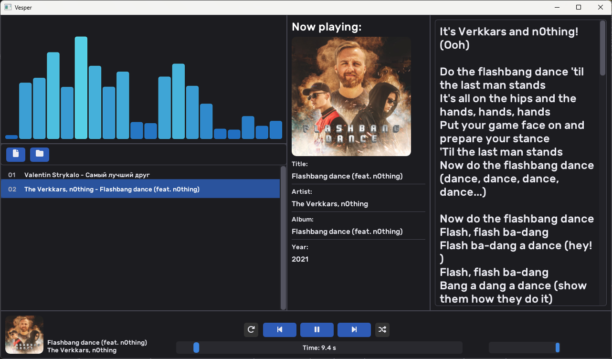

# **Vesper - Local music player.**
**Vesper - is a polished version of my player, based on echoa² and echoa-legacy (These are my old projects, formerly fastPlayMP3, echoa-play)** 



## **Warning: This is an unstable version. It contains bugs and some functionality is missing.**
### Current features

- Modern dark interface (ImGui + GLFW)
- Tag and album art parsing 
- Automatic lyrics fetching via lrclib.net
- Basic audio playback (im working on it)
- Spectrum visualizer

### Coming very soon
- Full audio playback (OpenAL Soft + FFmpeg)  
- Drag & drop, playlists, search

### Maybe coming soon
- Settings, EQ

## Build (Windows)
```bash
git clone https://github.com/rksaiz/Vesper.git
cd Vesper
cmake -B build -G "MinGW Makefiles" -DCMAKE_INSTALL_PREFIX="(folder to install)"
cmake --build build
cmake --install build
```

## License
Vesper itself is licensed under the Apache License 2.0

→ You may use, modify, and distribute it freely, even in proprietary/closed-source projects.

## Third-Party libraries & resources

- **GLFW**: Licensed under the zlib/libpng license.
- **ImGui**: Licensed under the MIT License.
- **OpenAL**: Licensed under the LGPL.
- **FFmpeg** Licensed under the LGPL.
- **GLEW**: Licensed under the Modified BSD License.
- **stb**: Licensed under the MIT License.
- **KISS FFT**: Licensed under the BSD-3-Clause License.
- **json by nlohmann** Licensed under the MIT License
- **libcurl**       curl license (MIT/X11-style) · SPDX: curl

This project uses the following fonts:
- **Font-awesome**: Licensed under the MIT license.
- **Rubik**: Licensed under the OFL license

Full license texts and required notices are in the `3rdparty/LICENSES/` folder.

## FFmpeg Libraries Notice

This application uses FFmpeg libraries provided as dynamic-link libraries (DLLs), which are licensed under the GNU Lesser General Public License version 2.1 or later (LGPL v2.1+).

The FFmpeg DLLs and associated header files included with this project come from the official FFmpeg shared builds, which can be found at https://ffmpeg.org/download.html.

You can obtain the source code for the FFmpeg libraries used here under the LGPL v2.1+ from the official FFmpeg website: https://ffmpeg.org/download.html

This application links to FFmpeg dynamically, allowing users to replace or update the FFmpeg DLLs independently.

Please see the `LICENSES` directory for more information.

## Thanks

- Omar Cornut and all Dear ImGui contributors  
- The authors of every library listed above  
- lrclib.net — awesome free lyrics database
- You — for checking this out

A ★ star is the best kind of thanks!
Found a bug? Have an idea? Issues and pull requests are always welcome!
